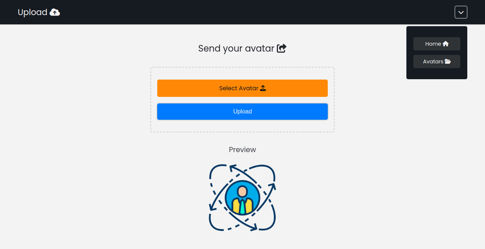
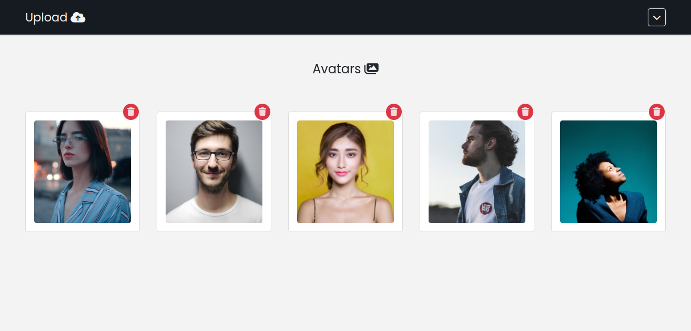

<h1 align="center">
  
  <br>
    Upload Avatar
  <br>
</h1>

<h4 align="center">
  Upload com redimensionamento de imagens em PHP, arquitetura MVC, progresso de upload, Axios, Fetch API, Mysql, OOP e muito mais.
</h4>

<p align="center">
  
  
  
</p>

<p align="center">
  <a href="#features">Features</a> •
  <a href="#how-to-use">How to User ?</a>
</p>




Website: [Upload Avatar]()

### Features

A aplicação explora vários recursos da linguagem PHP, como a funcionalidade GD para redimensionar as imagens. 

O sistema utiliza a arquitetura MVC, juntamente com recursos de funcionalidades assíncronas do Javascript, como a biblioteca Axios e Fetch API.

Além do mais, o upload das imagens são feitos no formato BLOB (Binary Large Object), sem a necessidade de armazenar arquivos no servidor ou em uma CDN, diminuindo a necessidade do uso de recursos.

As imagens são expostas através do header, tendo o conteúdo definido como image/jpeg a partir de uma URL com o ID na imagem.

* PHP
  - PDO (SQL)
  - OOP
  - SPL - Autoload
  - GB
* SQL
  - DDL / DML (BLOB)
* Javascript
  - Fetch API (Async)
  - Axios (Async)
  - Dropdown
* HTML/CSS

### How to use

Segue-se alguns passos para a execução da aplicação:

- Iniciar o servidor <b>Apache</b> e o <b>Mysql</b>.

- Copie a pasta do projeto para dentro do servidor <b>Apache</b>.

- Configure o arquivo <b>config.php</b> com suas credenciais de banco de dados e edite o <b>BASE_URL</b> conforme a o local do projeto, inclua a pasta <b>/app</b>.

- Ativar o ModRewrite: <b>comando via terminal</b>: ```a2enmod rewrite``` ou habilitar nas configurações do <b>Apache</b>.

- Executar os comandos <b>DDL</b> e <b>DML</b> do arquivo <b>database.sql</b>, o arquivo se encontra na raiz do projeto.


### License 📃


---

### Author 🧑‍💻
><a href="https://www.instagram.com/ericneves_dev/"></a> <a href="https://linkedin.com/in/ericnevesrr"> </a>
